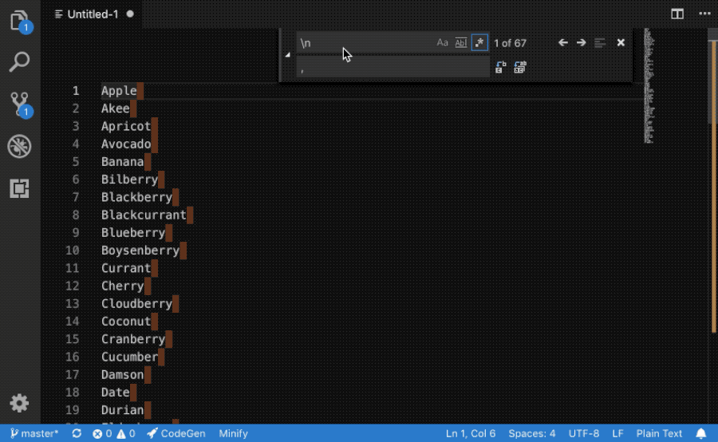
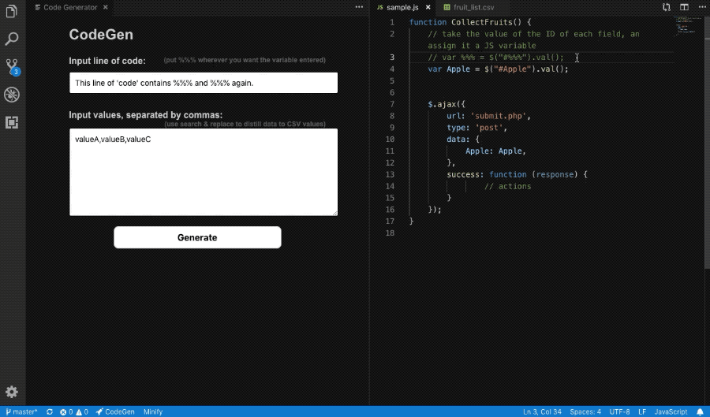

# CodeGen README

Instead of Search & Replace, this extension is to allow you to create similar lines of code that vary. Provide a list of comma seperated values, and a line of code with %%% wherever you want the value inserted, and for each of the list items, it will generate a corresponding line of code.

## Features

Quick and easy generation of lines of code to eliminate the need for manual copying and pasting.

# How to Use

Click the CodeGen button that will be installed on the status bar. This should open a panel which lets you enter your values (copy & paste them in) and hit Generate. Then simply copy and paste the resulting lines of code into your project.

## Use Search & Replace to get CSV values from a list

## Use panel side-by-side to copy and paste from multiple sources.
